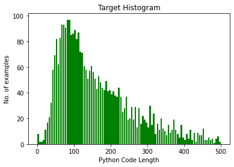
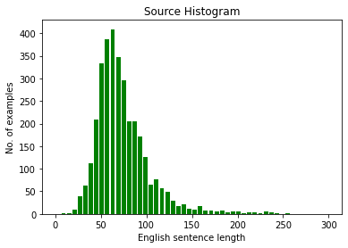

# Project
This project is to write a transformer-based model that can write python code (with proper whitespace indentations). For example:
Input: Write a python function to add two numbers 
Output:
```python
def add_num():
  num1 = 1.5
  num2 = 6.3
  res = num1 + num2
  return res
```
You can find the used sample code file (Data file) what we used to train the model
 [here](https://github.com/ranjanguddu/ENDPhase1/blob/main/Session-14/english_python_data.txt)

---
## Data Cleaning
---
For data cleaning firstly I tried to split the Data file. But it couldn't work as there are many comments line within the Program. So, finally I did some manual cleaning and create a file name 'Cleaned_Eng_Python_Data.txt' using Regex and then wrote a Python code to break the data in (key,value) : (English, Python) form.
```python
fundict ={}
with open('Cleaned_Eng_Python_Data.txt', 'r') as fR:

    for i in fR.readlines():

        if i.startswith('#') and  ('write' in i.lower() or 'python' in i.lower() or \
            'program' in i.lower() or 'function' in i.lower() or 'generate' in i.lower() or \
            'code' in i.lower() or 'given' in i.lower() or 'find' in i.lower() or 'calculate' in i.lower() or\
            'class' in i.lower() or 'define' in i.lower() or 'check' in i.lower() or 'compute' in i.lower() \
            or 'script' in i.lower() or 'calculate' in i.lower()):
            # print(i)
            key = i[1:]
            

            fundict[key]=''
            continue
        else:
            fundict[key]= fundict[key] + i

print(len(fundict))
```
Let's do some analysis:
```python
src = []
trg = []

max_key_len = 0
max_val_len = 0

src_len = []
trg_len = []

for k,v in fundict.items():
  src_len.append(len(k))
  trg_len.append(len(v))

  src.append(k)
  
  trg.append(v)
  
    
print(f'Key_len:{max(src_len)} and Value: {max(trg_len)}')

```
Let's draw the histogram of Target python Code:
```python
# setting the ranges and no. of intervals 
range = (0, 500) 
bins = 100  
  
# plotting a histogram 
plt.hist(trg_len, bins, range, color = 'green', 
        histtype = 'bar', rwidth = 0.8) 
  
# x-axis label 
plt.xlabel('Python Code Length') 
# frequency label 
plt.ylabel('No. of examples') 
# plot title 
plt.title('Target Histogram') 
  
# function to show the plot 
plt.show() 
```



Let's do with target sequences:
```python
# setting the ranges and no. of intervals 
range = (0, 300) 
bins = 50  
  
# plotting a histogram 
plt.hist(src_len, bins, range, color = 'green', 
        histtype = 'bar', rwidth = 0.8) 
  
# x-axis label 
plt.xlabel('English sentence length') 
# frequency label 
plt.ylabel('No. of examples') 
# plot title 
plt.title('Source Histogram') 
  
# function to show the plot 
plt.show() 
```




We can see from the above histogram that we can cover more than 80 percent sample with source sequence length less than 300 and target sequence length less than 400. Hence we have chosen only those samples having source length less than 300 and target length less than 400. 


```python
src = []
trg = []

for k,v in fundict.items():
  if len(k)<300 and len(v)<400:
    src.append(k)
    trg.append(v)
    
    
print(f'Key_len:{max(src_len)} and Value: {max(trg_len)}, english sentence:{len(src)} and python code:{len(trg)}')
```
Loss Function:
---
After trying many other loss function, finally I found cross-entropy is better.

python-code embedding
---
Used Python tokenizer library to take care of INDENT, NEW_LINE, COLON etc. and then parse through spacy_en model. Thanks to [Anubhab](https://in.linkedin.com/in/anubhabpanda) for helping me with this Python Tokenizer code. Used code for this tokenozation is:
```python
import argparse
import logging
import os
import random
import re
import sys
import tokenize
from io import BytesIO
from sacrebleu import tokenize_v14_international

TOK_NO_SPACE_BEFORE = {',', ';'}


PYTHON_TOKEN2CHAR = {'STOKEN0': '#',
                     'STOKEN1': "\\n",
                     'STOKEN2': '"""',
                     'STOKEN3': "'''"
                     }

PYTHON_CHAR2TOKEN = {'#': ' STOKEN0 ',
                     "\\n": ' STOKEN1 ',
                     '"""': ' STOKEN2 ',
                     "'''": ' STOKEN3 '
                     }


class ind_iter(object):
    def __init__(self, len):
        self.i = 0
        self.len = len

    def next(self):
        self.i += 1
        if self.i > (self.len - 1):
            raise StopIteration

    def prev(self):
        self.i -= 1
        if self.i < 0:
            raise StopIteration


def process_string(tok, char2tok, tok2char, is_comment):
    if is_comment:
        tok = re.sub(' +', ' ', tok)
        tok = re.sub(r"(.)\1\1\1\1+", r"\1\1\1\1\1", tok)
        if len(re.sub(r'\W', '', tok)) < 2:
            return ''
    tok = tok.replace(' ', ' ▁ ')
    for char, special_token in char2tok.items():
        tok = tok.replace(char, special_token)
    if tok.startswith(' STOKEN0'):
        if tok.endswith('\n'):
            tok = tok[:-1]
        tok += ' ENDCOM'
    tok = tok.replace('\n', ' STRNEWLINE ')
    tok = tok.replace('\t', ' TABSYMBOL ')
    tok = re.sub(' +', ' ', tok)
    tok = tokenize_v14_international(tok)
    tok = re.sub(' +', ' ', tok)
    for special_token, char in tok2char.items():
        tok = tok.replace(special_token, char)
    tok = tok.replace('\r', '')

    return tok


def tokenize_python(s, keep_comments=False):
    try:
        assert isinstance(s, str)
        s = s.replace(r'\r', '')
        tokens = []

        try:
            iterator = tokenize.tokenize(BytesIO(s.encode('utf-8')).readline)
        except SyntaxError as excep:
            raise SyntaxError(excep)

        removed_docstr = 0
        while True:
            try:
                toktype, tok, _, _, line = next(iterator)
            except (tokenize.TokenError, IndentationError, SyntaxError, UnicodeDecodeError):
                raise Exception(
                    f"Impossible to parse tokens because icorrect source code \"{s[0:30]}\" ...")
            except StopIteration:
                raise Exception(f"End of iterator before ENDMARKER token.")

            if toktype == tokenize.ENCODING or toktype == tokenize.NL:
                continue

            elif toktype == tokenize.NEWLINE:
                if removed_docstr == 1:
                    removed_docstr = 0
                    continue
                tokens.append('NEW_LINE')

            elif toktype == tokenize.COMMENT:
                if keep_comments:
                    com = process_string(
                        tok, PYTHON_CHAR2TOKEN, PYTHON_TOKEN2CHAR, True)
                    if len(com) > 0:
                        tokens.append(com)
                else:
                    continue

            elif toktype == tokenize.STRING:
                if tok == line.strip():  # docstring
                    if not keep_comments:
                        removed_docstr = 1
                        continue
                    else:
                        coms = process_string(
                            tok, PYTHON_CHAR2TOKEN, PYTHON_TOKEN2CHAR, True)
                        if len(coms) > 0:
                            tokens.append(coms)
                        else:
                            removed_docstr = 1
                else:
                    tokens.append(process_string(
                        tok, PYTHON_CHAR2TOKEN, PYTHON_TOKEN2CHAR, False))

            elif toktype == tokenize.INDENT:
                tokens.append('INDENT')

            elif toktype == tokenize.DEDENT:
                # empty block
                if tokens[-1] == 'INDENT':
                    tokens = tokens[:-1]
                else:
                    tokens.append('DEDENT')

            elif toktype == tokenize.ENDMARKER:
                tokens.append('ENDMARKER')
                break

            else:
                tokens.append(tok)

        assert (tokens[-1] == 'ENDMARKER'), "Error, no end marker"
        return tokens[:-1]
    except KeyboardInterrupt:
        raise
    except:
        return []


def detokenize_python(s):
    try:
        assert isinstance(s, str) or isinstance(s, list)
        if isinstance(s, list):
            s = ' '.join(s)
        s = s.replace('ENDCOM', 'NEW_LINE')
        s = s.replace('▁', 'SPACETOKEN')

        lines = s.split('NEW_LINE')
        tabs = ''
        for i, line in enumerate(lines):
            line = line.strip()
            if line.startswith('INDENT '):
                tabs += '    '
                line = line.replace('INDENT ', tabs)
            elif line.startswith('DEDENT'):
                number_dedent = line.count('DEDENT')
                tabs = tabs[4 * number_dedent:]
                line = line.replace("DEDENT", '')
                line = line.strip()
                line = tabs + line
            elif line == 'DEDENT':
                line = ''
            else:
                line = tabs + line
            lines[i] = line
        untok_s = '\n'.join(lines)

        # find string and comment with parser and detokenize string correctly
        try:
            for toktype, tok, _, _, line in tokenize.tokenize(BytesIO(untok_s.encode('utf-8')).readline):
                if toktype == tokenize.STRING or toktype == tokenize.COMMENT:
                    tok_ = tok.replace('STRNEWLINE', '\n').replace(
                        'TABSYMBOL', '\t').replace(' ', '').replace('SPACETOKEN', ' ')
                    untok_s = untok_s.replace(tok, tok_)
        except KeyboardInterrupt:
            raise
        except:
            pass

        # detokenize imports
        untok_s = untok_s.replace('. ', '.').replace(' .', '.').replace(
            'import.', 'import .').replace('from.', 'from .')
        untok_s = untok_s.replace('> >', '>>').replace('< <', '<<')
        return untok_s
    except KeyboardInterrupt:
        raise
    except:
        return ''
        
```

Trained Model Output:
---
```python
 1. python function to find the area of rectangle

 def rectangle_area ( l , b ) :
    return l * b

  2. Write a lambda function to multiply two numbers

  num1 = 10
  num2 = lambda a : a * b
  print ( f 'Sum: {result}' )
 
 3. python program to find the length of dictionary

 thisdict = { "brand" : "Ford" , "model" :    "Mustang" , "year" : 1964 }
 print ( f "Length of Dictionary:{len(thisdict)}" )

 4. Write a program to to print the contents of a given file

 fname = input ( "Enter file name: " )
 with open ( fname , 'r' ) as f :
    print ( f.read ( ) )

 5. python function that takes two lists as input and returns a zipped list of corresponding elements

 def zip_list ( list1 , list2 ) :
    return list ( zip ( list1 , list2 ) )

6. write a python program to find the smallest multiple of the first n numbers 

def smallest_multiple ( n ) :
    if ( n < = 2 ) :
        return n
    n = n * 2
    factors = [ ]
    while n < n :
        if n < = n :
            factors.append ( n )
            a + = 1
        return factors

7. write a program extract least frequency element

test_str = 'Gfg is best best best best for best best best geeks'
print ( "The original is : " + test_str )
res = { }
for key , key in test_str :
    if key = test_str.isdigit ( ) :
        res.isdigit ( )
    else :
        res = True
    res = res.append ( key )
print ( res )

8. python program to demonstrate Least Frequent Character in String

test_str = "Gfg"
print ( "The original string is : " + test_str )
all_freq = { }
for i in test_str :
    if i in all_freq :
        all_freq [ i ] + = 1
    else :
        all_freq [ i ] = 1
res = all_freq [ i ] = 1
print ( "The maximum of all characters in is : " + str ( res ) )

9. python program to calculate the area of a circle

def findArea ( r ) :
    PI = float ( r * r )
    return area
10. program to add two numbers

num1 = 1.5
num2 = 6.3
sum = num1 + num2
print ( f 'Sum: {sum}' )

11. given a list slice it into a 3 equal chunks and revert each list in python

sampleList = [ 11 , 45 , 45 , 45 , 45 , 89 ]
length = len ( sampleList )
start = chunkSize
start = chunkSize
for i in range ( 1 , 1 , 11 ) :
    if ( i ! = 0 ) :
        indexes = chunkSize
    else :
        end + = chunkSize
print ( "After reversing length length " , chunkSize )

12. write a python function to return the length of an array 
def arr ( arr ) :
    arr = [ ]
    for i in range ( n ) :
        if arr [ i ] > arr [ i ] :
            arr [ i ] = arr [ i ]
    return arr

13. python program to find factorial of number using recursion

def factorial ( n ) :
    if n < = 1 :
        return 1
    else :
        return n * factorial ( n - 1 )

14. write a python function to that performs as relu

def ReLU ( num ) :
    if num > 0 :
        return num
    return 0

15. python program to find uncommon words from two strings

def UncommonWords ( A , B ) :
    count = { }
    for word in A.split ( ) :
        count [ word ] = count.get ( word , 0 ) + 1
    for word in B.split ( ) :
        count [ word ] = count.get ( word , 0 ) + 1
    return [ word for word in count if count [ word ] = = 1 ]

16. write a python function to check whether a given year is a leap year

def check ( year , year ) :
    if ( year % 4 ) = = 0 :
        if ( year % 400 ) = = 0 :
            return False
        else :
            return False
17. write python program for illustration of values ( ) method of dictionary

test_dict = { 'Gfg' : 3 , 'is' : 8 , 'best' : 8 }
print ( "The original dictionary : " + str ( test_dict ) )
res = dict ( zip ( test_dict.values ( ) ) )
print ( "The dictionary of dictionary : " + str ( res ) )

18. write a python program to print a random number between 0 and 1

import random
print ( random.sample ( range ( 1 , 10 ) ) )

19. write a   program to find the sum of natural numbers

num = 16
if num < 0 :
    print ( "Enter a positive number" )
else :
    sum = 0
    while ( num > 0 ) :
        sum + = num
        num -= 1
    print ( "The sum is" , sum )

20. write a python function to return an iterator over the last n items

def deque ( iterable , n ) :
    return tuple ( iterable )


21. write a program to find and print the smallest among three numbers

def largest ( x , y ) :
    if x > y :
        return x
    elif x > y :
        return x
    else :
        smaller = x
print ( "The largest of" )
print ( num1 , largest )

22. python program to find and print the largest among three numbers
num1 = 10
num2 = 12
num3 = 12
if ( num1 > = num2 ) and ( num2 > = num3 ) :
    largest = num1
else :
    largest = num3
print ( "The largest of largest are" , largest )

23. write a program to find and print the smallest among three numbers

def largest ( x , y ) :
    if x > y :
        return x
    elif x > y :
        return x
    else :
        smaller = x
print ( "The largest of" )
print ( num1 , largest )

24. Write a program to filter the numbers in a list which are divisible by a given number


my_list = [ 11 , 45 , 74 , 74 , 74 , 74 , 74 , 74 , 44 , 721 , 721 , 721 ]
result = list ( filter ( lambda x : ( x % my_list = = 0 ) , my_list ) )
print ( f "Numbers divisible by {result} {result} are {result} is {result}" )


25. program to print the multiplication table of a given number

num = int ( input ( "Enter a number: " ) )
for i in range ( 1 , 11 ) :
    print ( num , ',' x ',i,i,' = ' , i , i )

```
